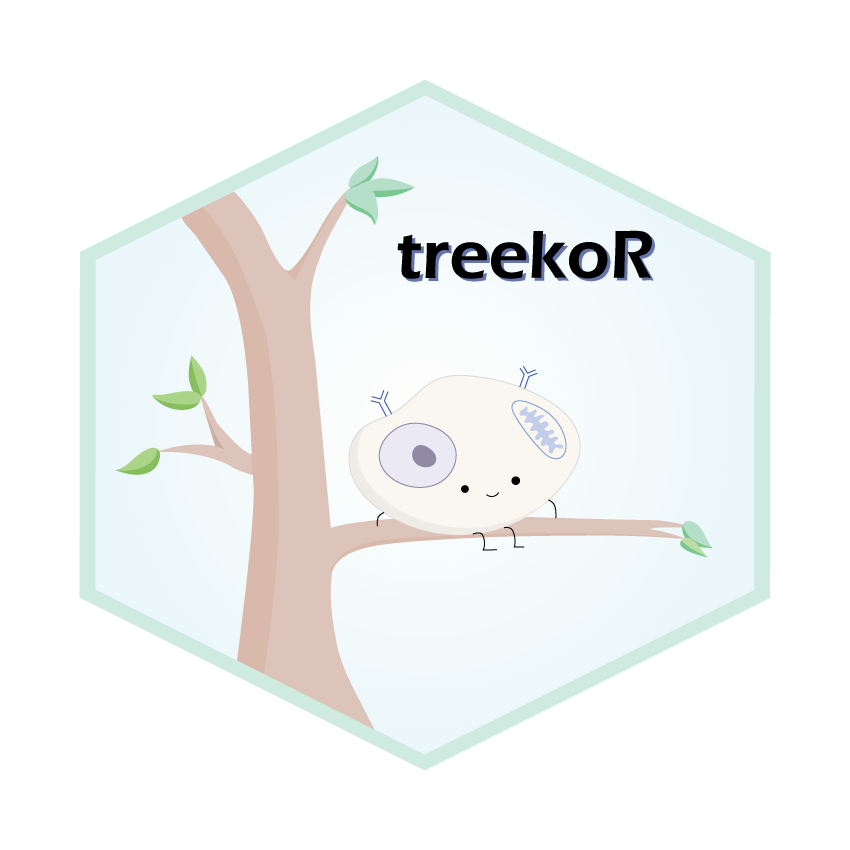

# `treekoR` 

## Overview
`treekoR` is a novel framework that aims to utilise the hierarchical nature of single cell cytometry data, to find robust and interpretable associations between cell subsets and patient clinical end points. treekoR achieves this by:

- Deriving the tree structure of cell clusters
- Measuring the %parent (proportions of each node in the tree relative to the number of cells belonging to the immediate parent node), in addition to the %total (proportion of cells in each node relative to all cells)
- Significance testing, using the calculated proportions, to determine cell type proportions associated with patient's clinical outcome of interest
- Providing an interactive html visualisation to help highlight key results

## Installation
```r
# Install the development version from GitHub:
# install.packages("devtools")
devtools::install_github("adam2o1o/treekoR")
library(treekoR)
```

or, via Bioconductor

```r
if (!requireNamespace("BiocManager", quietly = TRUE))
    install.packages("BiocManager")

BiocManager::install("treekoR")
```

### References

- 

---

### Found an issue (or have an idea)?

`treekoR` is still under active development. Any feedback related to the package and its use is immensely appreciated. 
- R package related issues should be raised [here](https://github.com/adam2o1o/treekoR/issues). 
